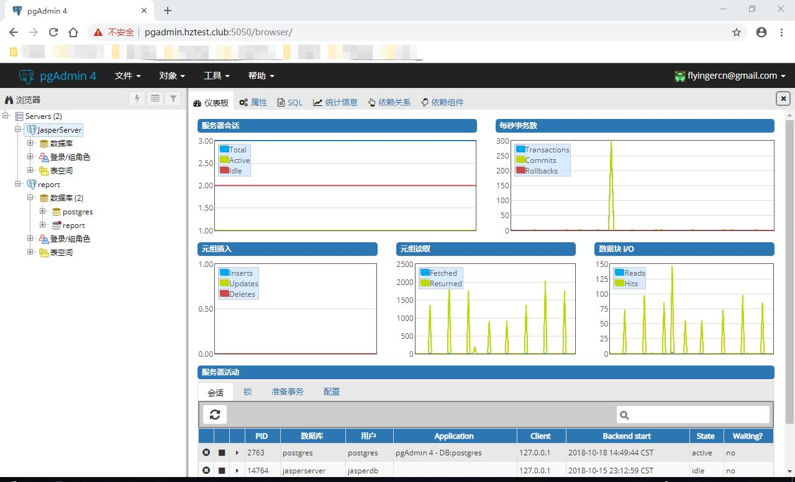

# CentOS 7.2 基于 Python 3.7 环境配置 PgAdmin 4
作者：老农民（刘启华）  
Email: 46715422@qq.com
  
基于上一篇 [CentOS 7.2 编译 Python 3.7.1 rc2](20181018_01.md) 中所写的环境，执行下面命令使用 Python 3.7
    
    . ~/clang.sh
    
然后使用下面命令安装虚拟机并创建虚拟环境  
    
    python3 -m pip install --upgrade pip --force-reinstall
    pip3 install virtualenv
	virtualenv /data/pgadmin4
    
安装 PgAdmin 4  
    
    pip3 install https://ftp.postgresql.org/pub/pgadmin/pgadmin4/v3.4/pip/pgadmin4-3.4-py2.py3-none-any.whl -i http://pypi.douban.com/simple/ --trusted-host pypi.douban.com
    
按照自己要求修改以下配置文件  
    
    /data/pgadmin4/lib/python3.7/site-packages/pgadmin4/config.py
    
建立 PgAdmin 4服务启动脚本  
    
    vi ~/pgadmin
    #! /bin/sh
    source /data/pgadmin4/bin/activate
    setsid python /data/pgadmin4/lib/python3.7/site-packages/pgadmin4/pgAdmin4.py
    	
将脚本 ~/pgadmin 加入 rc.local 即可。  
  
