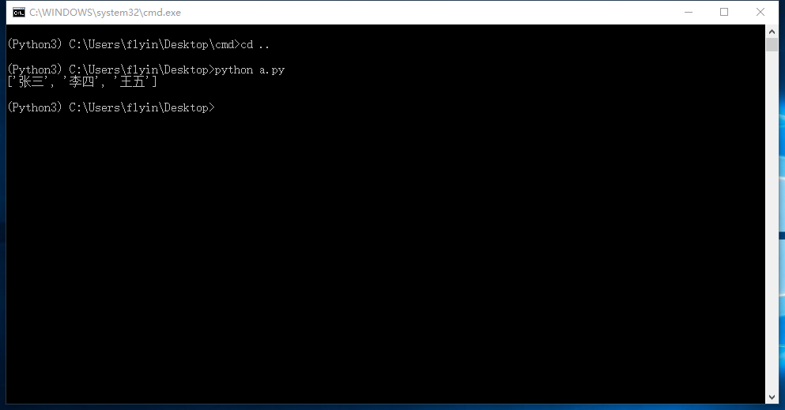

# CentOS 7.2 主机编译 Redis 5.0 正式版 Python 3.7 远程连接测试
作者：老农民（刘启华）  
Email: 46715422@qq.com
  
基于上一篇 [CentOS 7.2 编译 Python 3.7.1 rc2](20181018_01.md) 中所写的环境，执行下面命令使用 clang 进行编译  
    
    . ~/clang.sh
    
    wget http://download.redis.io/releases/redis-5.0.0.tar.gz
    tar xf redis-5.0.0.tar.gz
    cd redis-5.0.0/
    
    #32系统执行下面的行内容，然后再编译，否则不执行
    sed -i '1i\CFLAGS= -march=i686' src/Makefile
    
    make -j `grep processor /proc/cpuinfo | wc -l`
    mkdir -p /data/redis/{bin,etc,var}
    cp src/{redis-benchmark,redis-check-aof,redis-check-rdb,redis-cli,redis-sentinel,redis-server} /data/redis/bin/
    cp redis.conf /data/redis/etc/
    sed -i 's@pidfile.*@pidfile /var/run/redis/redis.pid@' /data/redis/etc/redis.conf
    sed -i "s@logfile.*@logfile /data/redis/var/redis.log@" /data/redis/etc/redis.conf
    sed -i "s@^dir.*@dir /data/redis/var@" /data/redis/etc/redis.conf
    sed -i 's@daemonize no@daemonize yes@' /data/redis/etc/redis.conf
    sed -i "s@^# bind 127.0.0.1@bind 127.0.0.1@" /data/redis/etc/redis.conf
    
    Mem=`free -m | awk '/Mem:/{print $2}'`
    redis_maxmemory=`expr $Mem / 8`000000
    [ -z "`grep ^maxmemory /data/redis/etc/redis.conf`" ] && sed -i "s@maxmemory <bytes>@maxmemory <bytes>\nmaxmemory `expr $Mem / 8`000000@" /data/redis/etc/redis.conf
    useradd -M -s /sbin/nologin redis
    chown -R redis:redis /data/redis/{var,etc}
    
  
建立启动脚本 redis  
    
    vi /etc/init.d/redis
    #! /bin/sh
    ### BEGIN INIT INFO
    # Provides:     redis
    # Required-Start:   $syslog
    # Required-Stop:    $syslog
    # Should-Start:     $local_fs
    # Should-Stop:      $local_fs
    # Default-Start:    2 3 4 5
    # Default-Stop:     0 1 6
    # Short-Description:    redis-server - Persistent key-value db
    # Description:      redis - Persistent key-value db
    ### END INIT INFO
    
    PATH=/usr/local/sbin:/usr/local/bin:/sbin:/bin:/usr/sbin:/usr/bin
    DAEMON=/data/redis/bin/redis-server
    DAEMON_ARGS=/data/redis/etc/redis.conf
    NAME=redis
    DESC=redis
    PIDFILE=/var/run/redis/redis.pid
    PIDDIR=`dirname $PIDFILE`
    
    test -x $DAEMON || exit 0
    test -x $DAEMONBOOTSTRAP || exit 0
    
    set -e
    
    case "$1" in
      start)
        echo -n "Starting $DESC: "
        # Make sure the default pidfile directory exists
        if [ ! -d $PIDDIR ]; then
          install -d -m 0755 -o redis -g redis $PIDDIR
        fi
        if start-stop-daemon --start --quiet --pidfile $PIDFILE --chuid redis:redis --exec $DAEMON -- $DAEMON_ARGS
        then
          echo "[OK]"
        else
          echo "failed"
        fi
        ;;
      stop)
        echo -n "Stopping $DESC: "
        if start-stop-daemon --stop --retry 10 --quiet --oknodo --pidfile $PIDFILE --exec $DAEMON
        then
          echo "[OK]"
        else
          echo "failed"
        fi
        ;;
      status)
        if [ ! -r $PIDFILE ] ; then
          echo "redis-server is stopped"
          exit 0
        fi
    
        PID=`cat $PIDFILE`
        if ps -p $PID | grep -q $PID; then
          echo "redis-server (pid $PID) is running..."
        else
          echo "redis-server dead but pid file exists"
        fi
        ;;
      restart|force-reload)
        ${0} stop
        ${0} start
        ;;
      *)
        echo "Usage: /etc/init.d/$NAME {start|stop|restart|status|force-reload}" >&2
        exit 1
        ;;
    esac
    
    exit 0
    
    chmod +x /etc/init.d/redis
    
    wget http://developer.axis.com/download/distribution/apps-sys-utils-start-stop-daemon-IR1_9_18-2.tar.gz
    cd apps/sys-utils/start-stop-daemon-IR1_9_18-2/
    cc start-stop-daemon.c -o /sbin/start-stop-daemon
    cd ../../../
    chkconfig --add redis
    chkconfig redis on
    
  
设置密码，开启远程访问redis
修改 /data/redis/etc/redis.conf  
找到以下行：  
# requirepass foobared  
去掉注释 # ，并设置密码：  
requirepass newpassword  
  
将：  
protected-mode yes  
改为：  
protected-mode no  
  
将：  
bind 127.0.0.1  
注释掉，或者改为：  
bind 0.0.0.0  
  
启动服务  
    
    service redis start
    
本机访问，需要输入密码：  
    
    /data/redis/bin/redis-cli
    auth newpassword
    
  
Windows 10 客户机远程通过 Python 访问主机的 redis  
    
    pip3 install redis
    
新建 testredis.py  
    
    # _*_ coding:utf-8 _*_
    import redis
    
    pool = redis.ConnectionPool( 
                                 host = 'redis.hztest.club', 
                                 port = 6379, 
			    				 password = 'admin12345678', 
				    			 db=0,
					    		 decode_responses = True 
						    	 )                       # 设置连接池
    								 
    r = redis.StrictRedis(connection_pool=pool)
    r.mset({"name1":'张三', "name2":'李四',"name3":'王五'})
    name=["name1","name2","name3"]
    print(r.mget(name))
    
