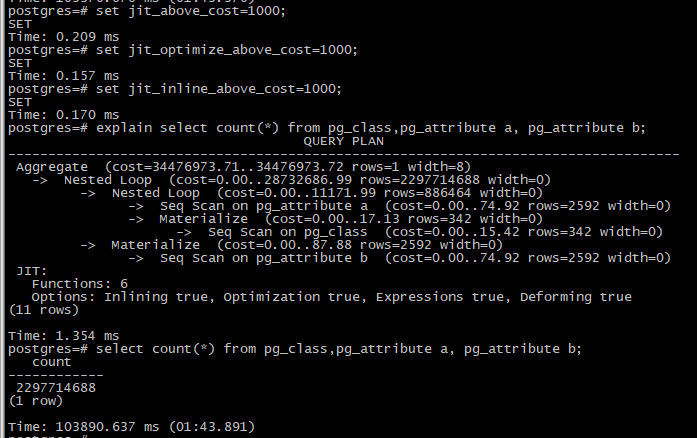

# CentOS 7.2 编译安装 PostgreSQL 11 并开启 JIT  
作者：老农民（刘启华）  
Email: 46715422@qq.com  
    
前置条件，请看[CentOS 7.2 编译安装 LLVM 7.0](20181022_01.md)，开启 JIT 支持必须用 LLVM 来编译才行。  
添加可能需要的包：  
    
    yum -y install autoconf libjpeg libjpeg-devel libpng libpng-devel libtool-ltdl libtool-ltdl-devel
    yum -y install freetype freetype-devel libxml2 libxml2-devel zlib zlib-devel glibc glibc-devel glib2 glib2-devel
    yum -y install bzip2 bzip2-devel ncurses ncurses-devel curl curl-devel e2fsprogs e2fsprogs-devel krb5 krb5-devel
    yum -y install libidn libidn-devel openssl openssl-devel openldap openldap-devel nss_ldap openldap-clients openldap-servers openldap-devel
    yum -y install libtiff libtiff-devel gettext gettext-devel libc-client libc-client-devel readline readline-devel pam pam-devel perl-ExtUtils-Embed uuid uuid-devel tcl-devel
    yum -y install coreutils glib2 lrzsz mpstat dstat sysstat e4fsprogs xfsprogs ntp readline-devel zlib-devel openssl-devel pam-devel libxml2-devel libxslt-devel python-devel tcl-devel gcc make smartmontools flex bison perl-devel perl-ExtUtils* openldap-devel
    
创建 PostgreSQL 用户和组，以及 PostgreSQL 数据目录和授权等。  
    
    /usr/sbin/groupadd postgres
    /usr/sbin/useradd -r -g postgres -s /bin/false -M postgres
    mkdir /home/postgres
    chown -R postgres:postgres /home/postgres
    mkdir -p /data/postgresdata
    chmod +w /data/postgresdata
    chown -R postgres:postgres /data/postgresdata
    
编译 PostgreSQL  
    
    wget https://ftp.postgresql.org/pub/source/v11.0/postgresql-11.0.tar.bz2
    tar xf postgresql-11.0.tar.bz2
    cd postgresql-11.0/
    CC="/usr/local/clang/bin/clang" ./configure --prefix=/data/pgsql --enable-nls="zh_CN zh_TW" --with-llvm LLVM_CONFIG="/usr/local/clang/bin/llvm-config" --with-perl --with-python --with-tcl --with-uuid=ossp --with-gssapi --with-pam --with-ldap --with-openssl --with-libxml --enable-thread-safety --with-zlib --without-selinux --with-readline --with-pgport=5433
    CC="/usr/local/clang/bin/clang" make world -j `grep processor /proc/cpuinfo | wc -l`
    CC="/usr/local/clang/bin/clang" make install-world
    cd contrib/
    CC="/usr/local/clang/bin/clang" make install clean
    cd ../
    cp -r contrib/ /data/pgsql/contrib
    ln -s  /data/postgresdata /data/pgsql/data
    chown -R postgres:postgres /data/pgsql/data
    su -l postgres -s /bin/bash -c "/data/pgsql/bin/initdb --locale=C -E UTF8 -D /data/pgsql/data/"
    sed -i "s#\#listen_addresses = 'localhost'#listen_addresses = '*'#" /data/pgsql/data/postgresql.conf
    sed -i 's#\#port = 5433#port = 5433#' /data/pgsql/data/postgresql.conf
    cp contrib/start-scripts/linux /data/pgsql/bin/postgresql
    ln -s /data/pgsql/lib/libpq.so.5 /usr/lib/libpq.so.5
    sed -i 's#su - $PGUSER -c#su -l $PGUSER -s /bin/bash -c#' /data/pgsql/bin/postgresql
    ln -s /data/pgsql/bin/postgresql  /etc/init.d/postgresql
    chmod +x /etc/init.d/postgresql
    chkconfig --add postgresql
    chkconfig postgresql on
    
编辑 /data/pgsql/data/postgresql.conf，去掉以下6行的注释，然后将设置 jit = on ，打开 JIT 设置  
    
    jit_above_cost = 100000
    jit_inline_above_cost = 500000
    jit_optimize_above_cost = 500000
    jit = on
    jit_provider = 'llvmjit'
    dynamic_library_path = '$libdir'
    
启动服务  
        
    service postgresql start
    
